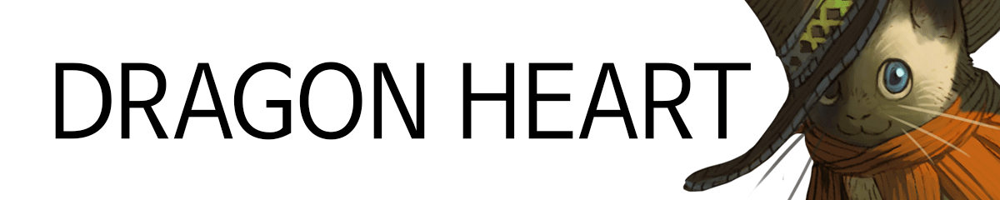
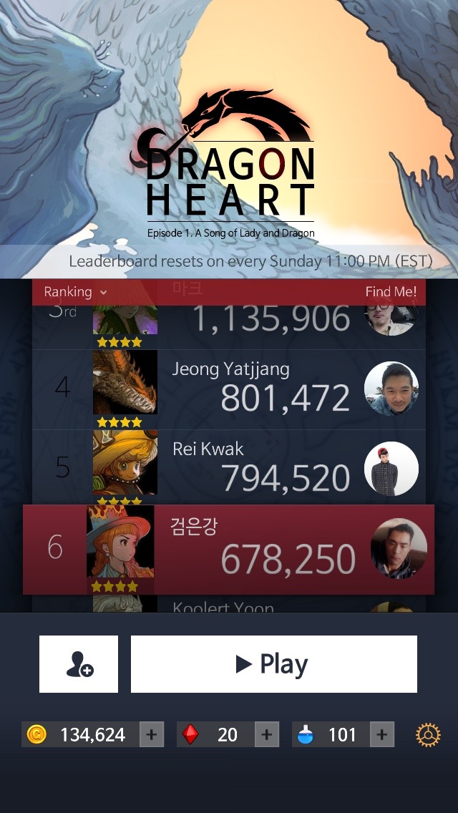
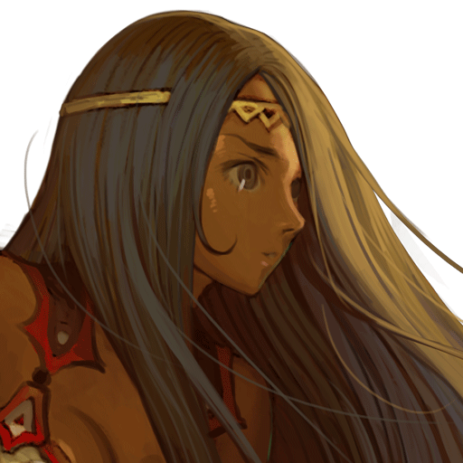

# 

## Factsheet

**Developer:**  
alteus soft  
Based in Korea, Republic of

**Category:**  
Block puzzle

**Platform:**  
[iOS][dnIos]  
[Android][dnAndroid]

**Release:**  
June, 2015

**Price:**  
Free to play,  
In app purchase

**Press / Business contact:**
[alteus@gmail.com][contact]

## Description

Dragon Heart is a puzzle game that when you select all the blocks of the same color, the blocks will disappear.
The users need to make friends between the heroes and monsters and grow them in order to get the high score.
It is an easy game to get the high score, but you are require to busily use your brain and a hand at the same time.

## Features

* **This is a new style of block puzzle game.**  
The rules are out of traditional 3 match style.
It is a game with the new rules which is combined with 'PokoPang‘s draw line', and 'super collapse's same color'.
It can be easy and difficult at the same time.
the combo and power, burst mode and other additional rules and character skills will make the game more interesting.

* **The play of the game depends on the character.**  
The final score will be increased due to the proportion of the gold which Moff will be obtained.
Just like the Gladiator, Theodore, whenever you eliminate the 4th block, you will get the extra scores.
The users will be replaced with new playing styles by the each character's skills.

* **The beautiful and unique graphics of the characters.**  
Dragon Heart is a story of adventures that is looking for the ancient magic stone to the dragon heart for different reasons.
If you admire the skills of the other players, you and the player become friends, and also meet them through gate of 

* **페이스북과 싱글 모드를 지원합니다.**  
친구들과 주간 단위로 점수를 경쟁합니다. 혼자 조용히 즐기고 싶은 사람들을 위해 싱글 모드도 제공됩니다.

## Videos

Promotion trailer on Google play store & Apple app store. [Youtube link](https://www.youtube.com/watch?v=HSUTVksSGtI "Promotion Trailer on Youtube")  

<iframe src="//www.youtube.com/embed/HSUTVksSGtI" frameborder="0" allowfullscreen></iframe>

 

This is play video with Kirke. [Youtube link](https://www.youtube.com/watch?v=dHthM5vA0OE "Play video on Youtube")
<iframe src="//www.youtube.com/embed/dHthM5vA0OE" frameborder="0" allowfullscreen></iframe>

## Images

download all screenshots & all characters as ** [.zip](assets/images/images.zip "Images zip") **

## Logo & Icon

download logo files as ** [.zip](assets/images/logoDragonHeart.zip "Logo & Icon zip") **

## Download

> * [Apple App store][dnIos]
> * [Google Play Store][dnAndroid]

<!--- =====================================================================  -->
<!--- Referenced links -->

[homepage]: http://companydomain.com "Company Name"

[contact]: mailto:alteus@gmail.com

[dnIos]: https://itunes.apple.com/app/id891176655
[dnAndroid]: https://play.google.com/store/apps/details?id=kr.alteus.DragonHeart

<!--- Social -->

[twitter]: https://twitter.com/companyname
[facebook]: https://facebook.com/companyname
[skype]: callto:companyskypename

<!--- Projects  -->

[Korean]: projects/DragonHeart_KR/
