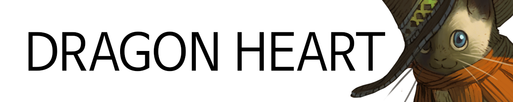

# 

## Factsheet

**Developer:**  
alteus soft  
Based in Korea, Republic of

**Category:**  
Block puzzle

**Platform:**  
[iOS][dnIos]  
[Android][dnAndroid]

**Release:**  
June, 2015

**Price:**  
Free to play,  
In app purchase

**Press / Business contact:**
[alteus@gmail.com][contact]

## Description

드래곤 하트는 같은 색의 블록을 모두 선택하면 없어지는 블록 퍼즐 게임입니다.
아름다운 그래픽의 영웅과 몬스터들을 동료로 만들어 성장 시키고 친구들과 점수 경쟁을 합니다.
한번만 해보면 바로 이해할 수 있을 정도로 쉽지만 높은 점수을 얻으려면 손과 머리를 바쁘게 움직여야 하는 게임입니다.

## Features

* **새로운 방식의 블록 퍼즐 게임입니다.**  
전통적인 3 매치 방식에서 벗어나 포코팡의 한줄 긋기와 수퍼 컬랩스의 세임 게임 방식이 혼합된 새로운 규칙입니다.
쉽지만 어렵습니다. 콤보와 파워, 버스트 모드같은 추가 규칙과 캐릭터 스킬을 잘 활용해야합니다.

* **캐릭터에 따라 게임의 플레이 방식이 달라집니다.**  
화염의 마법사 나르야는 붉은 색 보석을 없애면 콤보 시간이 증가합니다.
검투사 테오도르처럼 블록을 4번째 없앨 때마다 추가 점수를 얻는 스킬도 있습니다.
높은 점수를 얻기 위해선 캐릭터들의 스킬을 이해하고 그에 맞춰 플레이 방식을 최적화 시켜야합니다.

* **아름답고 독특한 그래픽의 캐릭터들,**  
드래곤 하트는 저마다 다른 이유로 용의 심장을 찾아 모험을 떠난 이들의 이야기입니다.
이들은 플레이어의 실력에 감탄해 동료가 되거나, 이계로 통하는 차원문을 통해 동료로 만들 수 있습니다.

* **페이스북과 싱글 모드를 지원합니다.**  
친구들과 주단위로 점수를 경쟁합니다. 혼자 조용히 즐기고 싶은 사람들을 위해 싱글 모드도 제공됩니다.

## About Team & Game.

드래곤하트는 유니티3d를 사용하여 제작한 인디 게임입니다.
5 ~ 10년 경력의 개발자가 4명이 모여 약 1년에 동안 개발하였습니다.

## Images

download all screenshots & photos as ** [.zip](../../assets/images/images.zip "Images zip") **

## Logo & Icon

download logo files as ** [.zip](../../assets/images/logoDragonHeart.zip "Logo & Icon zip") **

## Download

> * [Apple iOS][dnIos]
> * [Google Android][dnAndroid]

## Thank You!

<!--- =====================================================================  -->
<!--- Referenced links -->

[homepage]: http://companydomain.com "Company Name"

[contact]: mailto:alteus@gmail.com

[dnIos]: https://dragonheart.parseapp.com
[dnAndroid]: https://dragonheart.parseapp.com

<!--- Social -->

[twitter]: https://twitter.com/companyname
[facebook]: https://facebook.com/companyname
[skype]: callto:companyskypename

<!--- Projects  -->

[Korean]: projects/DragonHeart_KR/
